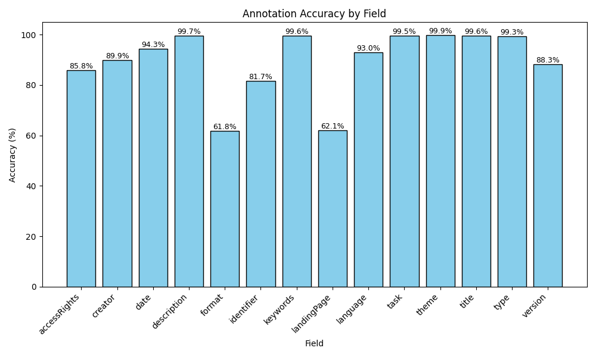

# MetaMine 🔍

[](https://www.python.org/downloads/)
[](https://opensource.org/licenses/Apache-2.0)

## A Neuro-Symbolic Approach for Dataset Extraction from Research Papers

MetaMine is a novel approach for extracting structured dataset metadata from scientific research papers. It utilizes a multi-stage chain-of-thought prompting strategy with knowledge distillation to train a compact model that can accurately identify and extract dataset metadata according to the DCAT vocabulary standard.

## 📋 Table of Contents
- [Overview](#-overview)
- [Pipeline Structure](#-pipeline-structure)
- [Key Features](#-key-features)
- [Directory Structure](#-directory-structure)
- [Installation and Dependencies](#-installation-and-dependencies)
- [Usage](#-usage)
- [Results](#-results)
- [License](#-license)

## 🔍 Overview

Scientific datasets are valuable knowledge assets often hidden within research papers, limiting their discovery and reuse. MetaMine addresses this challenge by:

1. Using a multi-stage chain-of-thought prompting strategy to guide large teacher models (GPT) in dataset identification and metadata extraction
2. Employing knowledge distillation to transfer these capabilities to a smaller student model (Llama-3.2-3B-Instruct)
3. Preserving the reasoning process during distillation for improved extraction accuracy
4. Aligning extracted metadata with the DCAT vocabulary for semantic web integration
5. Converting the structured output into RDF triples for knowledge graph creation

The distilled model processes papers in 35 seconds compared to 120 seconds for larger models, making it practical for processing large scientific corpora while maintaining high-quality extraction.

## 🏗️ Pipeline Structure

The MetaMine pipeline consists of four main phases:

1. **Data Collection and Processing**: Papers are collected from sources like Papers With Code and processed through OCR to extract text content.
2. **Data Annotation**: A teacher model (GPT-o4-mini) annotates papers using a multi-stage prompting strategy, and a subset is verified by human annotators.
3. **Knowledge Distillation**: The extraction capabilities and reasoning process are transferred to a smaller student model (Llama-3.2-3B-Instruct) through fine-tuning.
4. **Knowledge Graph Creation**: Extracted metadata is converted to RDF triples for integration with the semantic web.

## ✨ Key Features

- Efficient metadata extraction from scientific papers
- Multi-stage chain-of-thought prompting for accurate annotation
- Knowledge distillation for model compression
- Preservation of reasoning process during distillation
- DCAT vocabulary alignment for semantic web integration
- RDF triple generation for knowledge graph creation
- 3.4x faster processing than larger models

## 📁 Directory Structure

```
├── data/                  # Contains all data files
│   ├── aws/               # Amazon Mechanical Turk annotation files
│   ├── gs/                # Gold standard datasets
│   ├── llama/             # Generated output from the base Llama model
│   ├── llama_tuned/       # Generated output from the fine-tuned Llama model
│   └── qwen/              # Generated output from the DeepSeek Qwen model
├── fine_tuning/           # Scripts for fine-tuning the student model
├── inference/             # Scripts for generating dataset metadata using the fine-tuned model
└── results/               # Evaluation results for different models
```

## 💻 Installation and Dependencies

The project requires the following dependencies:
- Python 3.8+
- PyTorch
- Transformers
- PEFT (Parameter-Efficient Fine-Tuning)
- DeepSpeed
- Pandas
- Matplotlib
- pdfminer.six

## 🚀 Usage

The MetaMine pipeline consists of the following main scripts:

0. Download papers metadata from Papers With Code repository: https://github.com/paperswithcode/paperswithcode-data
1. `1_choose_papers_randomly.py`: Selects papers randomly from Papers With Code repository
2. `2_download_papers.py`: Downloads selected papers in PDF format
3. `3_pdf2txt.py`: Converts PDF files to text
4. `4_process_papers_fine_tune.py`: Processes papers with the teacher model to generate training data
5. `5_combine_datasets.py`: Merges the output of different models into a single dataset file
6. `6_combine_csv.py`: Processes Amazon Mechanical Turk annotations
7. `7_annotation_accuracy.py`: Analyzes annotation accuracy and generates figures
8. `8_order_columns.py`: Reorders columns in annotation files for better readability

### Fine-tuning the Model

To fine-tune the model, navigate to the `fine_tuning` directory and run:

```bash
bash run_fine_tune.sh
```

### Running Inference

To extract dataset metadata from new papers:

```bash
cd inference
bash inference.sh
```

## 📈 Results

The distilled model (Llama-3.2-3B-Instruct) achieves an F1 score of 0.74 for dataset identification, outperforming its pre-distillation baseline (0.65) and rivaling much larger models like DeepSeek-R1-Distill-Qwen-32B (0.73) despite being 10× smaller. The model particularly excels at challenging metadata fields like dataset creator identification.

### Annotation Accuracy

Running the `7_annotation_accuracy.py` script will generate an annotation accuracy figure showing the accuracy for each metadata field. This provides insights into which fields are more challenging for the model to extract correctly.

### Annotation Accuracy

The figure below shows the annotation accuracy for each metadata field extracted from papers. This provides insights into which fields are more challenging for the model to extract correctly.



> Note: Generate the annotation accuracy visualization by running:
> ```python
> python 7_annotation_accuracy.py
> ```


## 📄 License

This project is licensed under the Apache License 2.0 - see the [LICENSE](LICENSE) file for details.

## 🙏 Acknowledgments

We thank the following resources and communities:
- Papers With Code for providing access to research papers
- Hugging Face for Transformers and PEFT libraries
- Microsoft for DeepSpeed optimization
- Meta AI for the Llama model
- The semantic web community for DCAT vocabulary standards