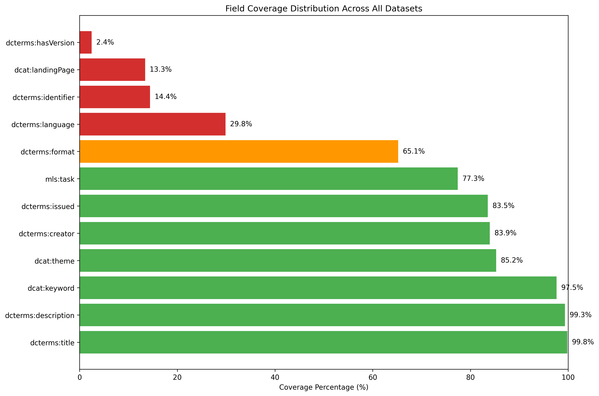

# Dataset Field Coverage Analysis Report

### Coverage Overview

- **Excellent Coverage (>95%)**: Basic metadata fields are very well populated
  - Title (99.75%)
  - Description (99.28%)
  - Keywords (97.54%)

- **Good Coverage (75-95%)**: Core attribution and classification fields
  - Theme/Categories (85.18%)
  - Creators/Authors (83.89%)
  - Publication Year (83.49%)
  - Task Classification (77.34%)

- **Moderate Coverage (25-75%)**: Format specification
  - Format (65.13%)
  - Language (29.78%)

- **Poor Coverage (<25%)**: External references and versioning
  - Identifier/DOI (14.35%)
  - Landing Page (13.34%)
  - Version Information (2.41%)
  
  
The poor coverage fields indicate that the imformation was not presented in the paper in order to be extracted.

## Field Coverage Distribution Chart

